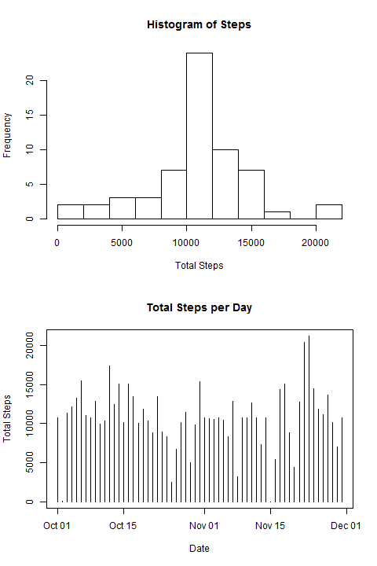

# Reproducible Research: Peer Assessment 1


#1. Loading and preprocessing the data

```r
        ## Reads in the data set, assuming it is in the current directory and is named "activity.csv"
        prepData <- function(){
                activity <- read.csv("activity.csv")
                
                ## Makes date and interval a date / time column
                activity$date <- as.Date(activity$date)
                ## Please note the following action reformats the intervals from "5" to "0005"
                activity$interval <- sprintf("%04d", activity$interval)
                ## Please note the following action reformats the intervals from "0005" to "00:05"
                activity$interval <- format(strptime(activity$interval, format = "%H%M"), format = "%H:%M")
                ## The prepared data set
                activity
        }
```


#2. What is mean total number of steps taken per day?
- The mean number of steps for day is 10,770 steps
- The median number of steps for day is 10,760 steps

## Code used to analyze data:

```r
        ## Calculates the total number of steps taken per day, from the data set x
        stepsTaken <- function(x){
                x <- na.omit(x)
                
                stepday <- as.data.frame.table(tapply(x$steps, x$date, sum))
                names(stepday) <- c("Date", "Steps")
                stepday$Date <- as.Date(stepday$Date)
                par(mfrow = c(1,2))
                ## Histogram and plot of total steps per day
                with(stepday,{ 
                        hist(Steps, xlab = "Total Steps")
                        plot(Steps ~ Date, xlab = "Date", ylab = "Total Steps", main = "Total Steps per Day", type = "h")
                })
                ## Displays the mean and median, along with other values
                summary(stepday$Steps)
        }
```
### Analysis Plots:
 

*The bottom plot was not required, but I believe it is a better depiction of total steps per day*


#3. What is the average daily activity pattern?
- 8:35 is the time (5-minute interval), on average across all days, that contains the max number of steps (206.1698 steps).

## Code used to analyze data:

```r
        ## Calulates the average number of steps per 5-minute interval, across all days
        actPat <- function(x){
                x <- na.omit(x)
                
                act <- as.data.frame.table(tapply(x$steps, x$interval, mean, na.rm = T))
                names(act) <- c("Interval", "Steps")
                par(mfrow = c(1,1))
                with(act, plot(Steps ~ Interval, type = "l"))
                with(act, lines(Steps ~ Interval))
                with(subset(act, Steps == max(Steps)), points(Steps ~ Interval, col = "red"))
                ## Orders the data from least to most steps, by 5-minute interval
                ## Then displays the 5-minute interval with the largest step value
                tail(act[order(act$Steps, act$Interval), ], n = 1)
        }
```
### Analysis Plots:
 


#4. Imputing missing values
- There are 2304 NA's in the dataset, in the steps column
- The 5-minute interval averages, across all days, were used to fill in the NA values
- The new mean number of steps for day is 10,770 steps, the same as the original
- The new median number of steps for day is 10,770 steps, ten more then the original

## Code used to analyze data:

```r
        ## Calulates the number of NA's, fills them with the 5-minute interval average, and returns a new data frame "y"
        missVals <- function(x){
                ## Prints the number of NA values in the data set
                print(paste(sum(is.na(x)), "NA's in the dataset"))
                ## Isolates the NA values and merges the data with a data set containing the averaged 5-minute intervals
                subna <- subset(x, is.na(x))
                subna$steps <- NULL
                act <- as.data.frame.table(tapply(x$steps, x$interval, mean, na.rm = T))
                names(act) <- c("interval", "steps")
                fillna <- merge(subna, act, by.x = "interval", by.y = "interval")
                y <- data.frame(rbind(na.omit(x), fillna))
                ## Prints the summary containing the new mean and median
                print(stepsTaken(y))
                y
        }
```
### Analysis Plots:
 

*The bottom plot was not required, but I believe it is a better depiction of total steps per day*


#5. Are there differences in activity patterns between weekdays and weekends?

## Code used to analyze data:

```r
        ## Splits the data into weekday and weekend and plots the outcome
        diffAct <- function(x){
                if(sum(!complete.cases(x) > 0)){
                        x <- missVals(x, FALSE)
                }
                
                days <- weekdays(x$date)
                wend <- c("saturday", "sunday")
                pow <- factor(levels = c("weekday", "weekend"))
                for(d in seq_along(days)){
                        if(tolower(days[d]) %in% wend){
                               pow[d] = "weekend" 
                        }
                        else{
                                pow[d] = "weekday"
                        }
                }
                x <- cbind(x, pow)
                
                xwdy <- subset(x, x$pow == "weekday")
                actwdy <- as.data.frame.table(tapply(xwdy$steps, xwdy$interval, mean, na.rm = T))
                names(actwdy) <- c("Interval", "Steps")
                
                xwed <- subset(x, x$pow == "weekend")
                actwed <- as.data.frame.table(tapply(xwed$steps, xwed$interval, mean, na.rm = T))
                names(actwed) <- c("Interval", "Steps")
        
                par(mfrow = c(2, 1), mar = c(4,4,2,1))
                with(actwdy, plot(Steps ~ Interval, type = "l"), main = "Weekdays")
                with(actwdy, lines(Steps ~ Interval))
                with(actwed, plot(Steps ~ Interval, type = "l"), main = "Weekend")
                with(actwed, lines(Steps ~ Interval))
        }
```
### Analysis Plots:
 
